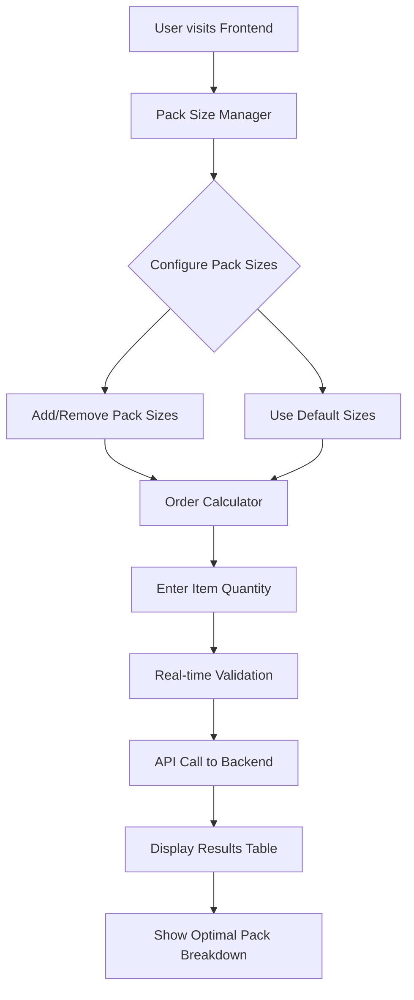
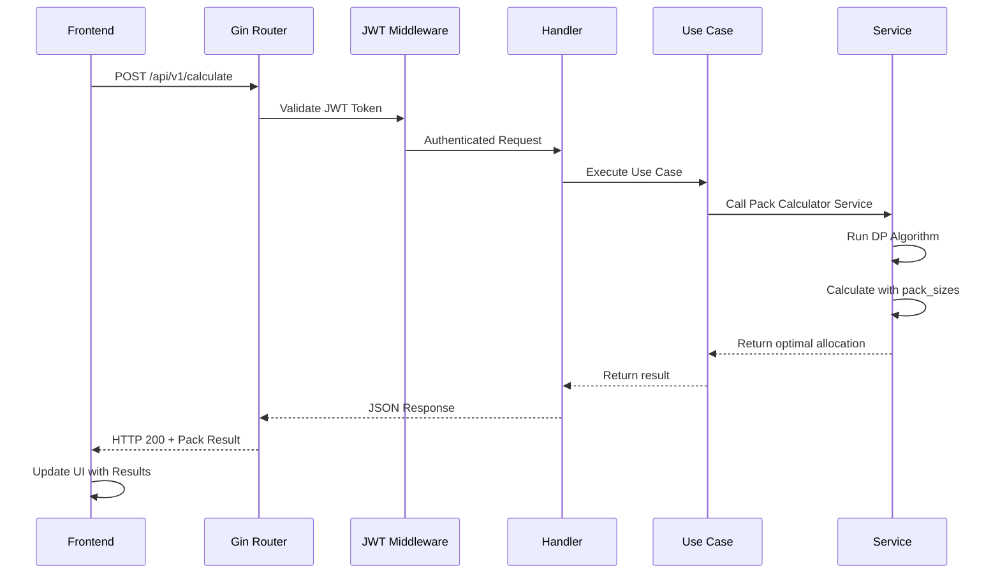

# Packs Calculator

<!-- Space for project demo video -->

---

A complete pack allocation calculator API built with Go, featuring optimal pack calculation algorithms, JWT authentication, and configuration management.

## Live Application

- **API**: [Your API URL]
- **Documentation**: [Your API URL]/swagger/index.html

## Architecture Overview

### Frontend Architecture

The frontend is a modern React application with a component-based architecture:

```
frontend/
├── src/
│   ├── components/      # React components
│   │   ├── ui/          # Reusable UI components (shadcn/ui)
│   │   ├── OrderCalculator.tsx    # Main calculator interface
│   │   ├── PackSizeManager.tsx    # Pack size management
│   │   └── ErrorBoundary.tsx      # Error handling
│   ├── lib/             # Utilities and store
│   └── assets/          # Static assets
├── public/              # Public assets
└── Docker files         # Containerization
```

#### Frontend Technology Stack

- **Framework**: React 19 with TypeScript
- **Build Tool**: Vite
- **Styling**: Tailwind CSS v4
- **UI Components**: shadcn/ui (New York style) with Radix UI primitives
- **State Management**: Zustand
- **Form Handling**: React Hook Form with Zod validation
- **Icons**: Lucide React
- **Package Manager**: pnpm

### Backend Architecture

The backend follows a clean architecture pattern with clear separation of concerns:

```
backend/
├── cmd/server/          # Application entry point
├── internal/            # Private modules
│   ├── adapter/         # External interfaces (HTTP, Config)
│   ├── domain/          # Core business entities
│   ├── dto/             # Data transfer objects
│   ├── service/         # Business logic layer
│   └── usecase/         # Application use cases
└── pkg/                 # Shared utilities
    ├── db/              # Database connection
    └── middleware/      # HTTP middleware
```

#### Backend Technology Stack

- **Language**: Go 1.24.3
- **Framework**: Gin
- **Database**: PostgreSQL 16
- **Authentication**: JWT
- **Documentation**: Swagger/OpenAPI
- **Testing**: Testify
- **Containerization**: Docker

## Getting Started

### Prerequisites

- **Docker Desktop**: Latest version with Docker Compose
- **Go**: Version 1.24.3+ (for local development)
- **Make**: For running automation commands

### Quick Setup

**Step 1: Clone & Setup**
```bash
git clone https://github.com/Schieck/packs-calculator
cd packs-calculator
make setup-dev
```

**Step 2: Verify Installation**
- **Frontend App**: http://localhost:5173
- **API**: http://localhost:8080
- **API Documentation**: http://localhost:8080/swagger/index.html
- **Health Check**: http://localhost:8080/health

**Step 3: Calculate Packs**
Use the React frontend or directly call the API:

**Frontend Interface**: 
- Visit http://localhost:5173
- Configure pack sizes in the Pack Size Manager
- Enter item quantities in the Order Calculator
- View real-time optimal pack calculations

**API Direct Access**:
```bash
curl -X POST http://localhost:8080/api/v1/auth/token \
  -H "Content-Type: application/json" \
  -d '{"secret": "your-auth-secret-change-in-production"}'

curl -X POST http://localhost:8080/api/v1/calculate \
  -H "Content-Type: application/json" \
  -H "Authorization: Bearer YOUR_TOKEN" \
  -d '{
    "items": 251,
    "pack_sizes": [250, 500, 1000, 2000, 5000]
  }'
```

### Development Commands

```bash
make setup-dev      # Complete development setup (first time)
make dev            # Hot-reload development mode
make docker-up      # Start all services with Docker
make docker-down    # Stop all services
make test           # Run all tests
make build          # Build the application
make clean          # Clean build artifacts
```

## 📡 API Endpoints

### Authentication
- `POST /api/v1/auth/token` - Get JWT token

### Pack Calculator
- `POST /api/v1/calculate` - Calculate optimal packs

### System
- `GET /api/v1/health` - Health check
- `GET /swagger/*` - API documentation

## ✨ Full Stack Features

This application combines a powerful Go backend with a modern React frontend:

### 🎯 **User Experience**
- **Intuitive Interface**: Clean, modern UI built with React 19 and Tailwind CSS
- **Real-time Calculations**: Instant pack optimization as you type
- **Dynamic Pack Management**: Add/remove pack sizes on the fly
- **Responsive Design**: Works seamlessly on desktop and mobile
- **Error Handling**: Graceful error boundaries and user feedback

### ⚡ **Performance & Reliability**
- **Fast Backend**: Go-powered API with efficient dynamic programming algorithm
- **Modern Frontend**: Vite build tool for lightning-fast development and builds
- **Type Safety**: Full TypeScript coverage with Zod validation
- **State Management**: Zustand for predictable state updates
- **JWT Authentication**: Secure API access

### 🛠️ **Developer Experience**
- **Hot Reload**: Instant feedback during development (Vite + Air)
- **Component Library**: shadcn/ui with beautiful, accessible components
- **Form Handling**: React Hook Form with validation
- **API Documentation**: Auto-generated Swagger documentation
- **Docker Support**: Full containerization for easy deployment

## 🧮 Pack Calculation Algorithm

See the complete explanation for the algorithm at the [Back-end README](./backend/README.md).

### Frontend User Flow



### API Request Flow



### Usage

```bash
curl -X POST http://localhost:8080/api/v1/calculate \
  -H "Content-Type: application/json" \
  -H "Authorization: Bearer YOUR_TOKEN" \
  -d '{
    "items": 251,
    "pack_sizes": [250, 500, 1000, 2000, 5000]
  }'
```

## 🧪 Testing

```bash
# Run all tests
make test

# Run specific module tests
cd backend && go test -v ./internal/service/pack_calculator
```

## 🤝 Contributing

1. Fork the repository
2. Run `make setup-dev` 
3. Make changes and add tests
4. Run `make test`
5. Submit Pull Request

## 📚 Documentation

- **API Documentation**: http://localhost:8080/swagger/index.html
- **Backend Details**: [backend/README.md](backend/README.md)
- **FrontEnd Details**: [frontend/README.md](frontend/README.md)

## 📄 License

This project is licensed under the MIT License - see the [LICENSE](LICENSE) file for details.

---

**Made with ❤️ by @Schieck for optimal pack calculations**
