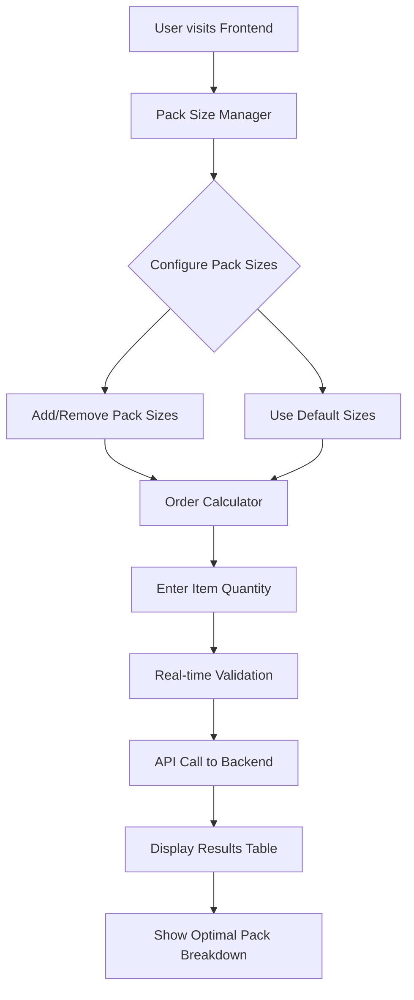
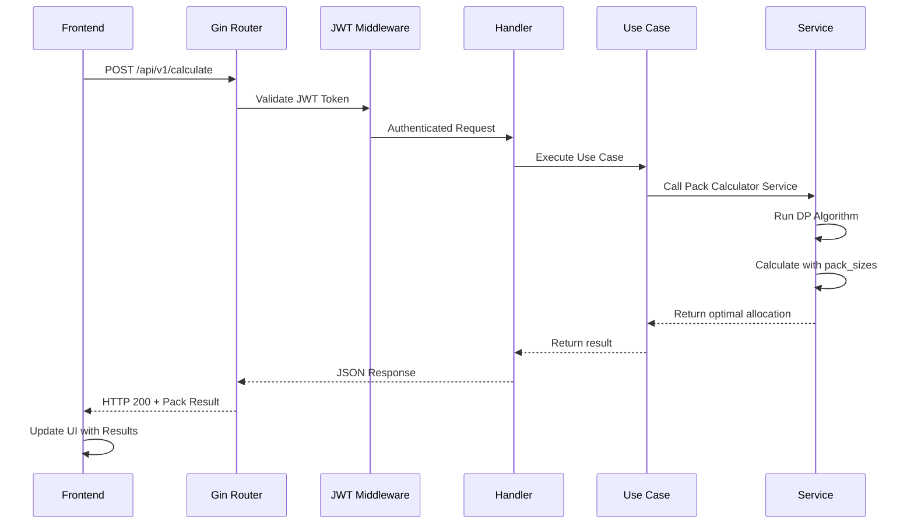

# Packs Calculator

I followed clean architecture for maintainability, testability, and clear separation of concerns.
I know that in Go interfaces are typically defined where they're used, but I placed them in the domain layer to prioritize architectural consistency and standardization across the codebase.
I implemented features like rich domain entities and comprehensive validation considering the tradeoffs between type safety vs. simplicity, performance vs. readability, and Go idioms vs. architectural purity; ultimately choosing consistency and maintainability to showcase this in a business-critical calculation system.


[packs-calculator-live-demo.webm](https://github.com/user-attachments/assets/1f94e8c6-0ad6-4136-bc0b-3b724b95c09f)

---

A complete pack allocation calculator API built with Go, featuring optimal pack calculation algorithms, JWT authentication, and configuration management.


## Architecture Overview

### Go Backend Architecture

The backend follows a clean architecture pattern with clear separation of concerns:

```
backend/
├── cmd/server/          # Application entry point
├── internal/            # Private modules
│   ├── adapter/         # External interfaces (HTTP, Config)
│   ├── domain/          # Core business entities
│   ├── dto/             # Data transfer objects
│   ├── service/         # Business logic layer
│   └── usecase/         # Application use cases
└── pkg/                 # Shared utilities
    ├── db/              # Database connection
    └── middleware/      # HTTP middleware
```

### Frontend Architecture

The frontend is a modern React application built with TypeScript and following Atomic Design principles:

```
frontend/
├── src/
│   ├── components/           # Component library (Atomic Design)
│   │   ├── atoms/           # Basic UI components
│   │   ├── molecules/       # Composite components
│   │   ├── organisms/       # Complex feature components
│   │   ├── ui/             # Shadcn/ui base components
│   │   ├── ErrorBoundary.tsx
│   │   └── TooltipProvider.tsx
│   ├── lib/                # Core utilities and logic
│   │   ├── store.ts        # Zustand state management
│   │   ├── api.ts          # API client and endpoints
│   │   ├── schemas.ts      # Zod validation schemas
│   │   ├── types.ts        # TypeScript definitions
│   │   ├── utils.ts        # Helper functions
│   │   └── hooks/          # Custom React hooks
│   ├── App.tsx             # Main application
│   └── main.tsx           # Entry point
├── public/                 # Static assets
├── Dockerfile             # Container configuration
├── nginx.conf            # Production server config
└── package.json          # Dependencies and scripts
```

## Getting Started

### Prerequisites

- **Docker Desktop**: Latest version with Docker Compose
- **Go**: Version 1.24.3+
- **Make**: For running automation commands
- **Node**: Version v24.1.0+
- **pnpm**: For the Frontend app

### Quick Setup

**Step 1: Clone & Setup**
```bash
git clone https://github.com/Schieck/packs-calculator
cd packs-calculator
make setup-dev
```

**Step 2: Verify Installation**
- **Frontend App**: http://localhost:5173
- **API**: http://localhost:8080
- **API Documentation**: http://localhost:8080/swagger/index.html
- **Health Check**: http://localhost:8080/health

**Step 3: Calculate Packs**
Use the React frontend or directly call the API:

**Frontend Interface**: 
- Visit http://localhost:5173
- Configure pack sizes in the Pack Size Manager
- Enter item quantities in the Order Calculator
- View real-time optimal pack calculations

**API Direct Access**:
```bash
curl -X POST http://localhost:8080/api/v1/auth/token \
  -H "Content-Type: application/json" \
  -d '{"secret": "your-auth-secret-change-in-production"}'

curl -X POST http://localhost:8080/api/v1/calculate \
  -H "Content-Type: application/json" \
  -H "Authorization: Bearer YOUR_TOKEN" \
  -d '{
    "items": 251,
    "pack_sizes": [250, 500, 1000, 2000, 5000]
  }'
```

### Development Commands

```bash
make setup-dev      # Complete development setup (first time)
make dev            # Hot-reload development mode
make docker-up      # Start all services with Docker
make docker-down    # Stop all services
make test           # Run all tests
make build          # Build the application
make clean          # Clean build artifacts
```

## 📡 API Endpoints

### Authentication
- `POST /api/v1/auth/token` - Get JWT token

### Pack Calculator
- `POST /api/v1/calculate` - Calculate optimal packs

### Pack Configuration Management
- `GET /api/v1/pack-configurations` - Get all pack configurations
- `GET /api/v1/pack-configurations/:id` - Get pack configuration by ID
- `GET /api/v1/pack-configurations/default` - Get default pack configuration
- `POST /api/v1/pack-configurations` - Create new pack configuration
- `PUT /api/v1/pack-configurations/:id` - Update pack configuration
- `DELETE /api/v1/pack-configurations/:id` - Delete pack configuration
- `PATCH /api/v1/pack-configurations/:id/default` - Set pack configuration as default

### System
- `GET /api/v1/health` - Health check
- `GET /swagger/*` - API documentation

## ✨ Full Stack Features

This application combines a powerful Go backend with a modern React frontend:

### 🎯 **User Experience**
- **Intuitive Interface**: Clean, modern UI built with React 19 and Tailwind CSS
- **Real-time Calculations**: Instant pack optimization as you type
- **Dynamic Pack Management**: Add/remove pack sizes on the fly
- **Responsive Design**: Works seamlessly on desktop and mobile
- **Error Handling**: Graceful error boundaries and user feedback

### ⚡ **Performance & Reliability**
- **Fast Backend**: Go-powered API with efficient dynamic programming algorithm
- **Modern Frontend**: Vite build tool for lightning-fast development and builds
- **Type Safety**: Full TypeScript coverage with Zod validation
- **State Management**: Zustand for predictable state updates
- **JWT Authentication**: Secure API access

### 🛠️ **Developer Experience**
- **Hot Reload**: Instant feedback during development (Vite + Air)
- **Component Library**: shadcn/ui with beautiful, accessible components
- **Form Handling**: React Hook Form with validation
- **API Documentation**: Auto-generated Swagger documentation
- **Docker Support**: Full containerization for easy deployment

## 🧮 Pack Calculation Algorithm

See the complete explanation for the algorithm at the [Back-end README](./backend/README.md).

### Frontend User Flow



### API Request Flow



### Usage

```bash
curl -X POST http://localhost:8080/api/v1/calculate \
  -H "Content-Type: application/json" \
  -H "Authorization: Bearer YOUR_TOKEN" \
  -d '{
    "items": 251,
    "pack_sizes": [250, 500, 1000, 2000, 5000]
  }'
```

## 🧪 Testing

```bash
# Run all tests
make test

# Run specific module tests
cd backend && go test -v ./internal/service/pack_calculator
```

## Next Steps

### **Product & User Experience**
- **User Research & Analytics**: Conduct user interviews to understand real-world pack calculation scenarios
- **Advanced Calculator Features**:
  - Bulk order processing with CSV import/export
  - Multi-item calculations with different pack size configurations
  - Cost optimization mode (factor in pack pricing)
  - Inventory management integration
- **User Preferences**: Save user-specific default pack configurations and calculation history
- **Reporting & Analytics**: Generate calculation reports, usage statistics, and optimization insights

### **Technical Enhancements**
- **CI/CD Pipeline**: Automated testing, building, and deployment with GitHub Actions
- **Enhanced Testing**:
  - Increase test coverage to 90%+
  - Add integration tests for API endpoints
  - Implement E2E testing with Playwright
  - Performance benchmarking for large calculations
- **Frontend Architecture**:
  - Implement proper error boundaries and loading states
  - Add comprehensive component testing with Testing Library
  - Optimize bundle size and implement code splitting
  - Add PWA capabilities for offline usage

### **Security & Performance**
- **Authentication & Authorization**:
  - User registration and management system
  - Role-based access control (RBAC)
  - OAuth integration (Google, GitHub)
- **Performance Optimization**:
  - Implement Redis caching for frequent calculations
  - Add request rate limiting and API throttling
  - Database integration for persistent pack configurations
  - Optimize algorithm for very large numbers (10M+ items)

### **Infrastructure & Scalability**
- **Production Deployment**:
  - Kubernetes deployment manifests
  - Auto-scaling configurations
  - Load balancing and health checks
  - Multi-environment setup (dev/staging/prod)
- **Monitoring & Observability**:
  - Application metrics with Prometheus
  - Distributed tracing with Jaeger
  - Error tracking with Sentry
  - Performance monitoring and alerting

### **Business Features**
- **Multi-tenancy**: Support for multiple organizations with isolated data
- **API Management**: Rate limiting, API keys, usage analytics
- **Data Export**: Integration with popular business tools (Excel, Google Sheets)
- **Mobile App**: React Native app for on-the-go calculations

## 🤝 Contributing

1. Fork the repository
2. Run `make setup-dev` 
3. Make changes and add tests
4. Run `make test`
5. Submit Pull Request

## 📚 Documentation

- **API Documentation**: http://localhost:8080/swagger/index.html
- **Backend Details**: [backend/README.md](backend/README.md)
- **FrontEnd Details**: [frontend/README.md](frontend/README.md)

## 📄 License

This project is licensed under the MIT License - see the [LICENSE](LICENSE) file for details.

---

**Made with ❤️ by @Schieck for optimal pack calculations**
