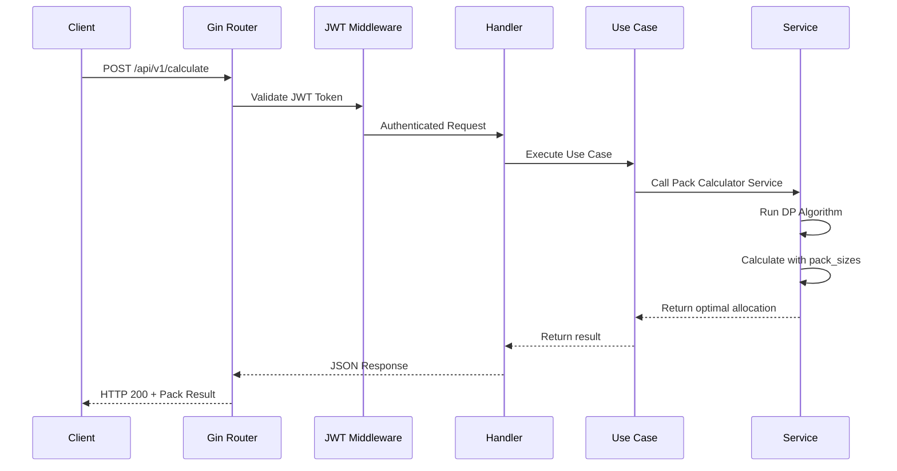

# Packs Calculator

<!-- Space for project demo video -->

---

A complete pack allocation calculator API built with Go, featuring optimal pack calculation algorithms, JWT authentication, and configuration management.

## Live Application

- **API**: [Your API URL]
- **Documentation**: [Your API URL]/swagger/index.html

## Architecture Overview

### Backend Architecture

The backend follows a clean architecture pattern with clear separation of concerns:

```
backend/
├── cmd/server/          # Application entry point
├── internal/            # Private modules
│   ├── adapter/         # External interfaces (HTTP, Config)
│   ├── domain/          # Core business entities
│   ├── dto/             # Data transfer objects
│   ├── service/         # Business logic layer
│   └── usecase/         # Application use cases
└── pkg/                 # Shared utilities
    ├── db/              # Database connection
    └── middleware/      # HTTP middleware
```

#### Technology Stack

- **Language**: Go 1.24.3
- **Framework**: Gin
- **Database**: PostgreSQL 16
- **Authentication**: JWT
- **Documentation**: Swagger/OpenAPI
- **Testing**: Testify
- **Containerization**: Docker

## Getting Started

### Prerequisites

- **Docker Desktop**: Latest version with Docker Compose
- **Go**: Version 1.24.3+ (for local development)
- **Make**: For running automation commands

### Quick Setup

**Step 1: Clone & Setup**
```bash
git clone https://github.com/Schieck/packs-calculator
cd packs-calculator
make setup-dev
```

**Step 2: Verify Installation**
- API: http://localhost:8080
- Swagger: http://localhost:8080/swagger/index.html
- Health: http://localhost:8080/health

**Step 3: Get Authentication Token**
```bash
curl -X POST http://localhost:8080/api/v1/auth/token \
  -H "Content-Type: application/json" \
  -d '{"secret": "your-auth-secret-change-in-production"}'
```

### Development Commands

```bash
make setup-dev      # Complete development setup (first time)
make dev            # Hot-reload development mode
make docker-up      # Start all services with Docker
make docker-down    # Stop all services
make test           # Run all tests
make build          # Build the application
make clean          # Clean build artifacts
```

## 📡 API Endpoints

### Authentication
- `POST /api/v1/auth/token` - Get JWT token

### Pack Calculator
- `POST /api/v1/calculate` - Calculate optimal packs

### System
- `GET /api/v1/health` - Health check
- `GET /swagger/*` - API documentation

## 🧮 Pack Calculation Algorithm

See the complete explanation for the algorithm at the [Back-end README](./backend/README.md).

### Request Flow



### Usage

```bash
curl -X POST http://localhost:8080/api/v1/calculate \
  -H "Content-Type: application/json" \
  -H "Authorization: Bearer YOUR_TOKEN" \
  -d '{
    "items": 251,
    "pack_sizes": [250, 500, 1000, 2000, 5000]
  }'
```

## 🧪 Testing

```bash
# Run all tests
make test

# Run specific module tests
cd backend && go test -v ./internal/service/pack_calculator
```

## 🤝 Contributing

1. Fork the repository
2. Run `make setup-dev` 
3. Make changes and add tests
4. Run `make test`
5. Submit Pull Request

## 📚 Documentation

- **API Documentation**: http://localhost:8080/swagger/index.html
- **Backend Details**: [backend/README.md](backend/README.md)

## 📄 License

This project is licensed under the MIT License - see the [LICENSE](LICENSE) file for details.

---

**Made with ❤️ by @Schieck for optimal pack calculations**
