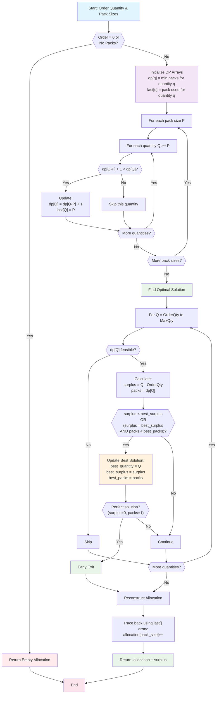

# Pack Calculator Backend

A high-performance microservice that calculates optimal package allocations for fulfilling orders. Built with **Go** using **Clean Architecture** principles, this service solves the classic "bin packing" problem with specific business constraints.

## Business Problem

When fulfilling orders, companies need to determine the optimal combination of pre-defined package sizes to meet customer demands while minimizing waste and shipping costs. This service solves three critical business requirements:

**R1 - Whole Packs Only**: Only complete packages can be shipped (no partial packs)  
**R2 - Minimize Surplus**: Reduce waste by minimizing excess items shipped  
**R3 - Minimize Packs**: When surplus is equal, prefer fewer packages to reduce shipping costs  

### Real-World Example
**Scenario**: Customer orders 251 items, available packs: [250, 500, 1000]
- **Bad Solution**: 2×250 = 500 items (249 surplus, 2 packs)
- **Optimal Solution**: 1×500 = 500 items (249 surplus, 1 pack)

Both have same surplus, but optimal uses fewer packs → lower shipping cost.

## Architecture Design

This project follows **Clean Architecture** principles with clear separation of concerns:

```
├── cmd/server/           # Application entry point
├── internal/
│   ├── domain/          # Business entities and rules (innermost layer)
│   │   └── entity/      # Core business models
│   ├── usecase/         # Application business logic
│   ├── service/         # Domain services (algorithms)
│   ├── adapter/         # External interfaces (HTTP, config)
│   └── dto/             # Data transfer objects
├── pkg/                 # Reusable packages
└── migrations/          # Database migrations
```

### Layer Responsibilities

**Domain Layer** (`internal/domain/entity/`)
- **PackSizes**: Validates and manages available package sizes
- **OrderQuantity**: Represents customer order with validation
- **PackAllocation**: Tracks how many packs of each size to use  
- **CalculationResult**: Wraps allocation with surplus information

**Service Layer** (`internal/service/pack_calculator/`)
- **PackCalculatorService**: Core algorithm implementation
- **Dynamic Programming Algorithm**: Solves optimal allocation problem

**Use Case Layer** (`internal/usecase/`)
- **CalculatePacksUseCase**: Orchestrates validation and calculation flow
- Input validation and logging

**Adapter Layer** (`internal/adapter/`)
- **HTTP Handler**: RESTful API endpoints with Swagger documentation
- **Configuration**: Environment-based settings

## Pack Calculator Algorithm

### Algorithm Overview
The core algorithm uses **Dynamic Programming** with an **Unbounded Knapsack** approach. This guarantees optimal solutions while maintaining excellent performance.

**Time Complexity**: `O(n·(Q+M))` where:
- `n` = number of distinct pack sizes
- `Q` = order quantity  
- `M` = largest pack size

**Space Complexity**: `O(Q+M)` with object pooling for optimization

### How It Works

The algorithm follows a systematic approach to find the mathematically optimal pack allocation:



#### Step 1: Dynamic Programming Setup
```go
// For each quantity from 0 to (orderQty + maxPackSize):
dp[q] = minimum packs needed to fulfill exactly q items
last[q] = which pack size was used to achieve dp[q]
```

#### Step 2: Fill DP Table
```go
for each pack_size in available_packs:
    for quantity from pack_size to max_quantity:
        if (dp[quantity - pack_size] + 1 < dp[quantity]):
            dp[quantity] = dp[quantity - pack_size] + 1
            last[quantity] = pack_size
```

#### Step 3: Find Optimal Solution
```go
best_quantity = -1
best_surplus = infinity
best_packs = infinity

for q from order_quantity to max_quantity:
    if dp[q] is feasible:
        surplus = q - order_quantity
        packs = dp[q]
        
        if (surplus < best_surplus) OR 
           (surplus == best_surplus AND packs < best_packs):
            best_quantity = q
            best_surplus = surplus  
            best_packs = packs
```

#### Step 4: Reconstruct Solution
```go
allocation = {}
current_quantity = best_quantity

while current_quantity > 0:
    pack_used = last[current_quantity]
    allocation[pack_used]++
    current_quantity -= pack_used
```

### Performance Optimizations

**Object Pooling**: DP arrays are pooled and reused to reduce garbage collection pressure in high-throughput scenarios.

**Early Termination**: Algorithm stops immediately when perfect solution (0 surplus, 1 pack) is found.

**Bounded Search Space**: Search space is limited to `orderQty + maxPackSize` to guarantee at least one feasible solution exists.

### Algorithm Examples

#### Example 1: Exact Match
```
Input: order=500, packs=[250, 500, 1000]
DP Table: dp[500] = 1, last[500] = 500
Result: {500: 1}, surplus=0
```

#### Example 2: Minimum Surplus Priority  
```
Input: order=251, packs=[250, 500]
Options:
- 2×250 = 500 items (surplus=249, packs=2)
- 1×500 = 500 items (surplus=249, packs=1) [OPTIMAL]
Result: {500: 1}, surplus=249 (fewer packs wins)
```

#### Example 3: Complex Optimization
```
Input: order=12001, packs=[250, 500, 1000, 2000, 5000]
Result: {5000: 2, 2000: 1, 250: 1} = 12250 items
Surplus: 249, Total Packs: 4
```

## API Documentation

### POST `/calculate`
Calculate optimal pack allocation for an order.

**Request:**
```json
{
  "items": 251,
  "pack_sizes": [250, 500, 1000]
}
```

**Response:**
```json
{
  "allocation": {
    "500": 1
  },
  "total_packs": 1,
  "total_items": 500,
  "surplus": 249
}
```

**Business Rules Enforced:**
- Only whole packs used (`total_items >= items`)
- Minimum surplus achieved (`surplus = total_items - items`)  
- Minimum packs when surplus tied

### Authentication
All endpoints require JWT Bearer token authentication.

### Swagger Documentation
Available at `/swagger/index.html` when running the server.

## Technology Stack

**Core Framework:**
- **Go 1.24+**: High-performance, concurrent language
- **Gin**: Fast HTTP web framework with middleware support
- **PostgreSQL**: Robust relational database with migrations

**Architecture & Testing:**
- **Clean Architecture**: Domain-driven design with dependency injection
- **Comprehensive Testing**: Unit, integration, and performance tests  
- **Swagger/OpenAPI**: Auto-generated API documentation

**DevOps & Monitoring:**
- **Docker**: Containerization with multi-stage builds
- **Air**: Hot-reload development server
- **Structured Logging**: JSON-formatted logs with slog

## Quick Start

### Prerequisites
- Go 1.24+
- PostgreSQL 13+
- Docker (optional)

### Local Development
```bash
# Clone and navigate
cd backend/

# Install dependencies  
go mod download

# Run with hot-reload
go run github.com/air-verse/air@latest

# Or run directly
go run cmd/server/main.go
```

### Docker Deployment
```bash
# Build and run
docker build -t pack-calculator .
docker run -p 8080:8080 pack-calculator
```

### Environment Variables
```bash
# Database
DB_HOST=localhost
DB_PORT=5432
DB_USER=pack_calculator
DB_PASSWORD=secure_password
DB_NAME=pack_calculator_db

# Server
PORT=8080
JWT_SECRET=your-secret-key
```

## Testing

```bash
# Run all tests
go test ./...

# Run with coverage
go test -cover ./...

# Run specific test suite
go test ./internal/service/pack_calculator/...

# Performance tests
go test -bench=. ./internal/service/pack_calculator/
```

**Test Coverage**: Core algorithm has >95% test coverage with comprehensive edge cases including:
- Zero orders and empty pack sizes
- Large quantities (500,000+ items) 
- Complex optimization scenarios
- Performance stress tests

## Performance Characteristics

**Throughput**: >10,000 requests/second on modern hardware  
**Latency**: <1ms for typical orders, <10ms for extreme cases (500K items)  
**Memory**: <6MB RAM for worst-case scenarios with object pooling  

**Scalability**: Stateless design enables horizontal scaling with load balancers.

## Key Business Benefits

1. **Cost Optimization**: Minimizes packaging and shipping costs through intelligent allocation
2. **Waste Reduction**: Reduces surplus items, improving sustainability and profit margins  
3. **Scalability**: Handles enterprise-scale orders with millisecond response times
4. **Reliability**: Comprehensive testing ensures accurate calculations under all conditions
5. **Integration Ready**: Clean REST API with OpenAPI documentation for easy integration

## Technical Decisions & Rationale

**Dynamic Programming Choice**: Guarantees mathematically optimal solutions unlike greedy algorithms which may produce suboptimal results.

**Clean Architecture**: Separates business logic from infrastructure concerns, enabling easy testing and future modifications.

**Object Pooling**: Reduces garbage collection pressure in high-throughput production environments.

**Comprehensive Validation**: Domain entities enforce business rules at creation time, preventing invalid states.
