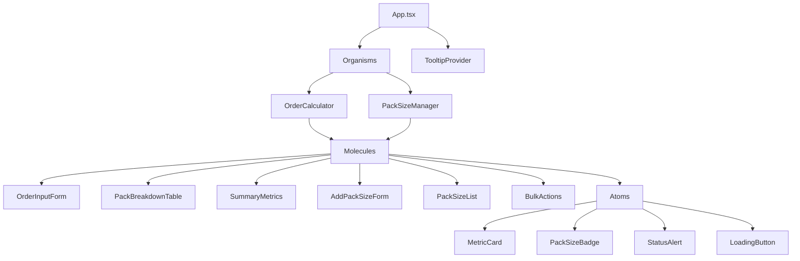
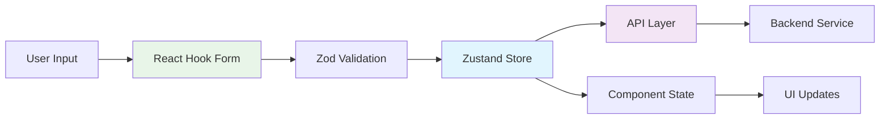

# Pack Optimization Calculator - Frontend

A modern React application for calculating optimal pack sizes and order fulfillment. Built with TypeScript, Vite, and follows atomic design principles for scalable component architecture.

## Overview

This application helps businesses optimize their packaging strategies by calculating the most efficient pack sizes for customer orders. It features real-time calculations, pack size management, and detailed breakdowns of order fulfillment strategies.

## Architecture

### Component Architecture (Atomic Design)



### State Management & Data Flow



### Technology Stack

**Core Framework:**
- React 19
- TypeScript 5.8
- Vite 6.3

**Styling & UI:**
- Tailwind CSS 4.1
- Radix UI Components
- Lucide Icons
- Class Variance Authority (CVA)

**State & Forms:**
- Zustand Store
- React Hook Form
- Zod Validation

**Development Tools:**
- ESLint
- TypeScript ESLint
- Path Aliases (@/ imports)

**Quality & Reliability:**
- Error Boundaries
- Type Safety
- Form Validation

## Project Structure

```
frontend/
├── src/
│   ├── components/           # Component library (Atomic Design)
│   │   ├── atoms/           # Basic UI components
│   │   │   ├── MetricCard.tsx
│   │   │   ├── PackSizeBadge.tsx
│   │   │   ├── StatusAlert.tsx
│   │   │   └── LoadingButton.tsx
│   │   ├── molecules/       # Composite components
│   │   │   ├── OrderInputForm.tsx
│   │   │   ├── PackBreakdownTable.tsx
│   │   │   ├── SummaryMetrics.tsx
│   │   │   └── PackSizeManager.tsx
│   │   ├── organisms/       # Complex feature components
│   │   │   ├── OrderCalculator.tsx
│   │   │   └── PackSizeManager.tsx
│   │   └── ui/             # Shadcn/ui components
│   ├── lib/                # Utilities and core logic
│   │   ├── store.ts        # Zustand state management
│   │   ├── api.ts          # API client and endpoints
│   │   ├── schemas.ts      # Zod validation schemas
│   │   ├── types.ts        # TypeScript type definitions
│   │   └── utils.ts        # Helper functions
│   ├── App.tsx             # Main application component
│   └── main.tsx           # Application entry point
├── public/                 # Static assets
├── Dockerfile             # Container configuration
├── nginx.conf            # Production server config
└── package.json          # Dependencies and scripts
```

## Getting Started

### Prerequisites

- Node.js 24+ (specified in `.nvmrc`)
- pnpm (recommended package manager)

### Installation

1. **Clone and navigate to frontend directory**
   ```bash
   cd frontend
   ```

2. **Install dependencies**
   ```bash
   pnpm install
   ```

3. **Start development server**
   ```bash
   pnpm dev
   ```

4. **Open your browser**
   Navigate to `http://localhost:5173`

### Available Scripts

| Command | Description |
|---------|-------------|
| `pnpm dev` | Start development server with hot reload |
| `pnpm build` | Build for production |
| `pnpm preview` | Preview production build locally |
| `pnpm lint` | Run ESLint for code quality |

## Docker Deployment

### Development
```bash
docker build -t pack-calculator-frontend .
docker run -p 80:80 pack-calculator-frontend
```

### Production
The Dockerfile uses a multi-stage build:
1. **Builder stage**: Installs dependencies and builds the app
2. **nginx stage**: Serves static files with optimized nginx configuration

## Development

### Code Organization

- **Atomic Design**: Components are organized by complexity (atoms → molecules → organisms)
- **Path Aliases**: Use `@/` for clean imports (`@/components`, `@/lib`)
- **Type Safety**: Full TypeScript coverage with strict configuration
- **Form Handling**: React Hook Form with Zod validation for robust form management
- **State Management**: Zustand for lightweight, type-safe global state

### Key Features

- **Real-time Order Calculations**: Instant feedback on pack optimization
- **Pack Size Management**: Add, remove, and manage available pack sizes
- **Performance Metrics**: Detailed breakdown of efficiency and waste
- **Modern UI**: Responsive design with Tailwind CSS
- **Error Handling**: Comprehensive error boundaries and validation
- **Performance**: Optimized builds with Vite and code splitting

### Component Guidelines

1. **Atoms**: Pure, reusable UI components with no business logic
2. **Molecules**: Combinations of atoms that serve specific functions
3. **Organisms**: Complex components that implement business features
4. **Error Boundaries**: Wrap complex components for graceful error handling

## Styling

- **Tailwind CSS 4.1**: Utility-first CSS framework
- **Radix UI**: Accessible, unstyled component primitives
- **CVA**: Class variance authority for component variants
- **Responsive Design**: Mobile-first approach with breakpoint utilities

## License

This project is part of the Pack Optimization Calculator system.
